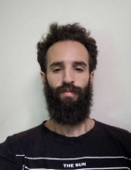

ElMiqdam ZineElAbidine

CONTACT Zinelabidiin@outlook.com

 +(212)609432368 

 Telegram : @philanthropistchermit  Discord : RogerP#8905

 https://github.com/Zinelabidiin

WORK EXPERIENCE Laboratory Atlas Diamond 

Courier Manager

Centre Hospitalier Universitaire Hassan II

Polyvalent nurse

Transsion Holdings/Carlcare

Sales supervisor /+ Customer support (Fes-Meknes-Taza)

(employee of the year 2019 trophy)

January 2018 — June 2018

June 2018 — January 2019

November 2017 —  2018 August 2019 — August 2021

Freelance - Timify 

WordPress tutor, HelpDesk Technicien

LANGUAGE

\>English IELTS : B2 (overall score : 6.5) (competent user) 

\>Français TCF : CO:B2, CE:B1, EE:B1, EO:B1 (medium)

\>Arabic : native

\>Japanese : learning

FORMATION

Baccalaureate (physics sciences)  September 2013 — September 2014

Lycée Salah Eddine ElAyoubi, Fes Morocco

ISFPPM diploma, Bachelor equivalent / Nurse  September 2017

-Graduation research : future operated preparation to prevent and reduce anxiety within the surgery

operation room 

UDEMY / OPEN COURSE

Autodictate : Network Fundamentals, CRM, EMR, Data Science 

certification / E-learning

-Google Ads Search :                        attained In 2022 -Microsoft Azure AZ-900 :                   attained In 2022 -MIcrosoft DYnamics 365 Fundamentals CRM :  attained in 2022 -Programming in C bootcamp )\_2019\_2022\_(

Information Technology

-Reparation & maintenance : Software + Hardware / smartphones, computers, routers & switches -Great OS manipulation OSX /Windows /linux /iOS & Android

-knowledge and experimentation with  Adobe Creative Cloud

-Google developers

-Microsoft Azure / Power Platform  (ongoing)

-Amazon AWS EC2 / S3 (ongoing)

-Cisco CCNA CCNP (ongoing)

INTERESTS / PASSIONS

//Technology:\_Game moding\_Web Development\_Audio mixing and post

`  `processing\_Programming\_cryptography\_Software tweaking //Health:\_Hiking\_Yoga\_Nutrition\_Natation

//Culture:\_anime\_Music production\_conception/entrepreneurship 1

ElMiqdam ZineElAbidine 2
